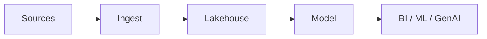
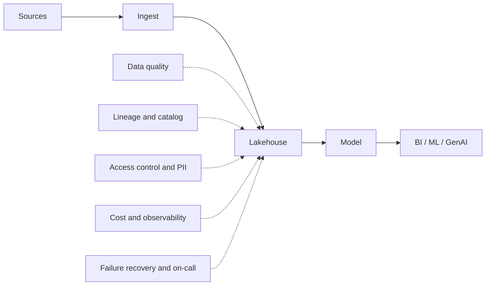

# Priyank Mishra

**Data & Cloud Solutions Architect**

*I design data platforms, then live with them in production.*

       

---

**Most AI programmes do not fail on the model. They fail on the data underneath it.**

13+ years across data engineering, cloud architecture and platform delivery. Most of my work is enterprise modernisation: moving companies off legacy ETL onto Snowflake, Databricks and AWS, and making the result something a team can actually operate.

---

### The diagram everyone draws

### The diagram that decides whether it survives

Most of my work lives in the second picture.

---

### What I am building here

Small, real projects that test what new platform features actually do. Build a working pipeline, break it the way it breaks in production, then fix it.

The failure is the interesting part, not the feature.

### Stack

**Data** Snowflake · Databricks · Delta Lake · Unity Catalog · Iceberg · dbt · Airflow · PySpark · Kafka

**AWS** Glue · EMR · Lambda · Step Functions · Athena · Redshift · S3 · Lake Formation · SageMaker

**Platform** Terraform · GitHub Actions · Docker · Python · SQL · Scala

### Writing and video

I share production lessons on YouTube, LinkedIn and X. Mostly what happens after the architecture diagram becomes a system somebody has to support at 2 AM.

[YouTube](https://www.youtube.com/@priyankmishraa) · [LinkedIn](https://www.linkedin.com/in/priyankmishraa) · [X](https://x.com/priyankmishraa) · [priyankmishra.in](https://priyankmishra.in)

Reach me at me@priyankmishra.in
